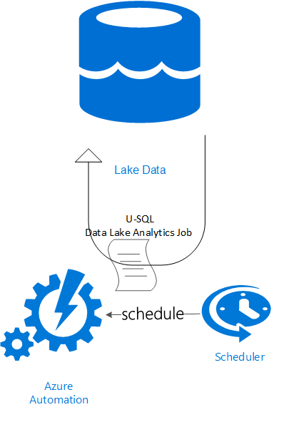

# Azure Automation Data Lake Analytics Scheduled Job 

Using Azure Automation, Azure Scheduler and Data Lake Analytics Job to execute a U-SQL query against a Data Lake Store.

## Scenario
An iterative task need to be executed against data stored in a Data Lake Store. The task in this example is an append on files stored in the data lake store. 
A Data Lake Anaytics Job is submitted using Azure Automation. Azure Scheduler is used, since the minimal interval for the built in scheduler for Azure Automation is 1 hour. This will allow better granularity with 10 minute intervals.
In this scanario I assume that you have already setup a Data Lake Store.

## Deployment Setup Flow
The deployment flow is implemented in [automateDataLakeJob.ps1](automateDataLakeJob.ps1) powershell script, and consists of 4 parts:

1. Create a storage account and upload all the neccecary assets to it:
	 - [appendQuery.usql](assets/appendQuery.usql): u-sql to be executed in the data Lake Analytics job
	 - [AzureRM.DataLakeAnalytics.zip](assets/AzureRM.DataLakeAnalytics.zip): powershell module for Data Lake Analytics. This will be uploaded during the setup since Azure Automation does not come pre-loaded with this module
	 - [Submit-DataLakeAnalyticsJob.ps1](assets/Submit-DataLakeAnalyticsJob.ps1): Automation runbook script
2. Deploy an ARM template [automationAccountDeployment.json](automationAccountDeployment.json) to create an Azure Automation account with:	
	- Runbook with script
	- DataLakeAnaytics powershell module
	- Variables to be used by the script in the runbook
	- Credentials object with Azure AD user to execute the automation scripts with.
3. Create a webhook in the Automation runbook (at the moment this can't be done via ARM template)
4. Create an Azure Scheduler collection and an HTTP job with the Automation runbook webhook as the POST uri

## Authenticating with Azure Automation
Azure Automation requires an Azure Active Directoy organizational user to authenticate. There are some limitations - the user can not have multi factor authentiation enabled, and as of now service principle authentication (for Azure Resource Manager) is not supported. I would recommnd to create a user specificly for the Automation jobs. This user info (username and passowrd) will be stored in Credentials assets in the Automation Account. For more information, read [this](https://azure.microsoft.com/en-gb/blog/azure-automation-authenticating-to-azure-using-azure-active-directory/) tutorial.

## Executing the Script
Forks this repository, and edit [automateDataLakeJob.ps1](automateDataLakeJob.ps1) with your information:

1. If you have more han one subcription in your account, set the right id <subscription id>
2. Set the automation ADD user name <automation ADD user name>
3. Set the automation AAD password <sutomation ADD password>
4. Set the Data Lake account name <data lake account name>
5. Set the Data Lake resource group <data lake resource group>
6. Set the automation account webhook expiry date <webhoop expiry date>
7. Set the scheduler job start time <scheduler job start date>

Note that in this scanario the scheduler job interval is 10 minutes. 

## References

[Scheduling Azure Automation with Azure Scheduler](https://azure.microsoft.com/en-us/blog/scheduling-azure-automation-runbooks-with-azure-scheduler-2/)

[Azure Automation Authentication](https://azure.microsoft.com/en-gb/blog/azure-automation-authenticating-to-azure-using-azure-active-directory/)

[Azure Automation ARM Powerhsell Modules](http://blog.coretech.dk/jgs/azure-automation-script-for-downloading-and-preparing-azurerm-modules-for-azure-automation/)

[Azure Data Lake Analytics Powershell](https://azure.microsoft.com/en-us/documentation/articles/data-lake-analytics-get-started-powershell/)
